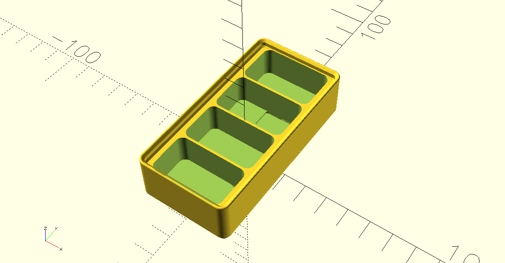
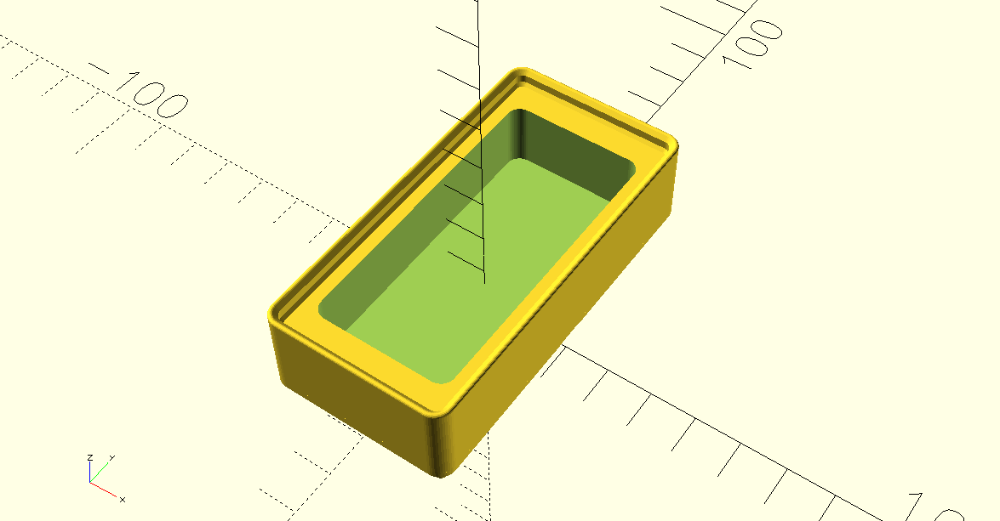

# Custom Gridfinity Bins by Benjie
[![CC BY 4.0][cc-by-shield]][cc-by-sa]

## Models
### Batteries - 9V
Holds 4 9V batteries on a 1x2 unit base.


### Batteries - AA 
Holds 10 AA batteries on a 1x2 unit base.


### Batteries - Sony NP-FW50
Holds 4 Sony NP-FW50 batteries on a 1x2 unit base.



### Charger - Wasasbi Power LCH-DC
Holds a single Wasabi Power LCH-DC battery charger on a 1x2 unit base.


### LED - Ulanzi VL49
Holds a single Ulanzi VL49 portable LED light on a 1x2 unit base.




### Lens - Sigma DC DN 
Holds a Sigma DC/DN series lens for Sony cameras. Tested with Sigma 16mm f1.4, Sigma 56mm f1-4, and Sigma 18-50mm f2.8. 


### Macro Adapter - Meike MK-S-AF3B
Holds a single Meike MK-S-AF3B macro adapter.


### Remote - JJC RM DSLR2

### Remote - RC-A5

### Remote - YN 608


## Dependencies
My [fork](git@github.com:benjiao/gridfinity-rebuilt-openscad.git) of [Gridfinity Rebuilt in OpenSCAD by kennetek](https://github.com/kennetek/gridfinity-rebuilt-openscad) is included in this repo as a submodule. To install, run:
```
git submodule update --init --recursive
```

## License
All work under this collection is licensed under a
[Creative Commons Attribution-ShareAlike 4.0 International License][cc-by-sa], unless noted otherwise.

---
[](https://ko-fi.com/C0C24WFYS) 

[cc-by-sa]: http://creativecommons.org/licenses/by-sa/4.0/
[cc-by-shield]: https://img.shields.io/badge/License-CC%20BY%20BY%20SA%204.0-lightgrey.svg
